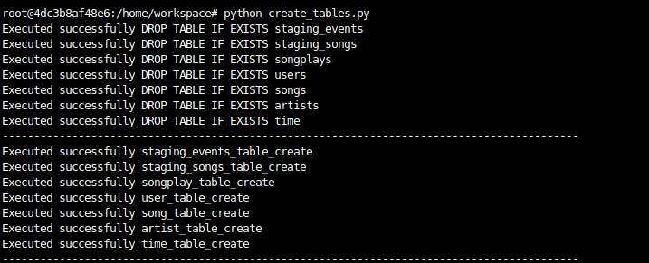
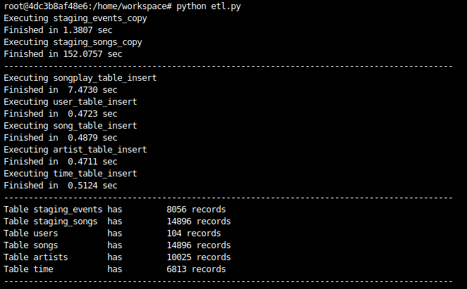

# SparkifyDb (Data Warehouse)  

#### Purpose
The ETL project is designed and implemented to help my company Sparkify to perform analysis on users' song play activity using our new music app using AWS for Data Warehouse purpose.

#### Database schema design and ETL pipeline
Database design follows the STAR schema for tables. It has a Fact table : songplays and four Dimension tables: songs, artists, time and users.

**What** the user was listening to (songs)
**Which** artist was user listening to (artists)
**When** the user was listening to the songs (time)
**Who** was listening the songs (users)

**How** and Where the user was listening to the songs (songplays)


The data is ingested from _Amazon S3_ to _Amazon Redshift_ databases. Data gets copied from two source folders _song_data_ and _log_data_ using COPY in two staging tables: staging_songs and staging_events respectively. Data is further filtered, transformed and inserted in the dimension and fact tables using SQL query statements. The tables are in their normal form to avoid any duplication and taking into consideration the efficiency of running the most frequent queries.

#### Example of some analysis query that can be tried in Query Editor:
- How many paid users were there?
   ```sh
  SELECT count(*) from users where level='paid';
   ```
- How many free users were there?
   ```sh
  SELECT count(*) from users where level='free';
   ```
- Most frequently listened artists or songs?
   ```sh
  SELECT song_id, COUNT(song_id) from songplays GROUP BY song_id ORDER BY COUNT(song_id) DESC LIMIT 1;
  SELECT artist_id, COUNT(artist_id) from songplays GROUP BY artist_id ORDER BY COUNT(artist_id) DESC LIMIT 1;
  SELECT time.weekday, COUNT(time.weekday)
  FROM time JOIN songplays
  ON time.start_time = songplays.start_time
  GROUP BY time.weekday
  ORDER BY COUNT(time.weekday) DESC LIMIT 1;
   ```
- Weekday with most activity?
   ```sh
  SELECT time.weekday, COUNT(time.weekday)
  FROM time JOIN songplays
  ON time.start_time = songplays.start_time
  GROUP BY time.weekday
  ORDER BY COUNT(time.weekday) DESC LIMIT 1;
  ```

#### How to use the product?
0. Set up Amazon Redhsift cluster and update the dwh.cfg file with Redshift cluster's HOST credentials and IAM role ARN.

1. Run create_tables.py from terminal to drop existing tables and create new tables.
```sh
root@0cc7f703976a:/home/workspace# python create_tables.py
```




2. Run etl.py from terminal to read in staging tables data and insert records in the star schema tables.
```sh
root@0cc7f703976a:/home/workspace# python etl.py
```




3. Use Query Editor in Cluster to add and run analytical queries.   
   


### REMEMBER: Make sure to `delete` cluster to avoid unneccessary cost after testing